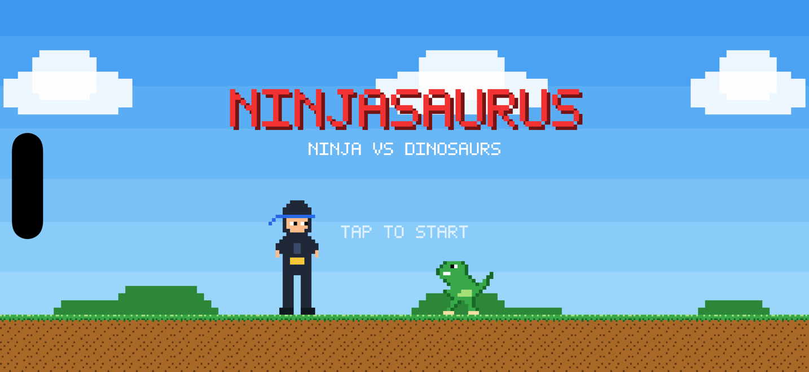
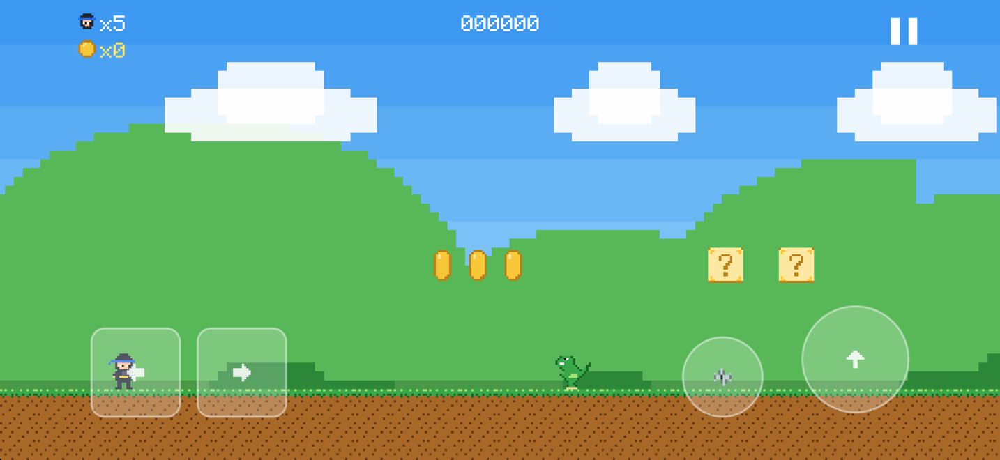
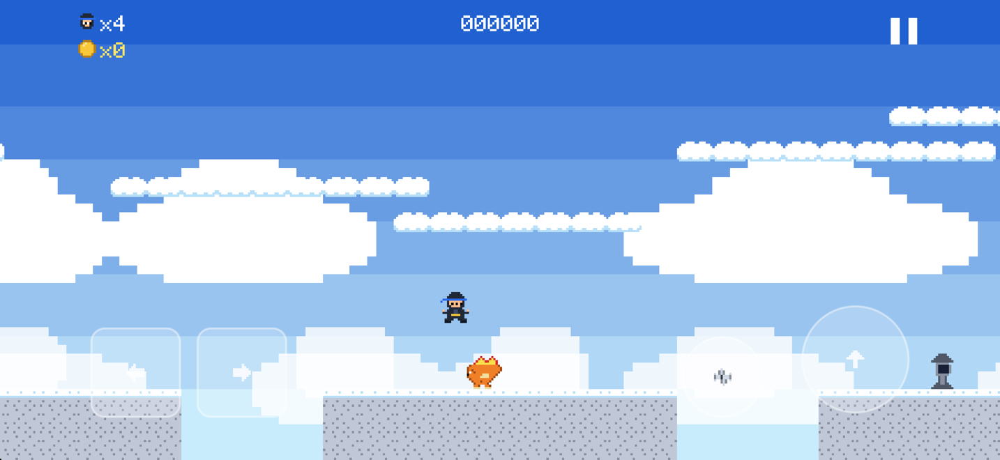
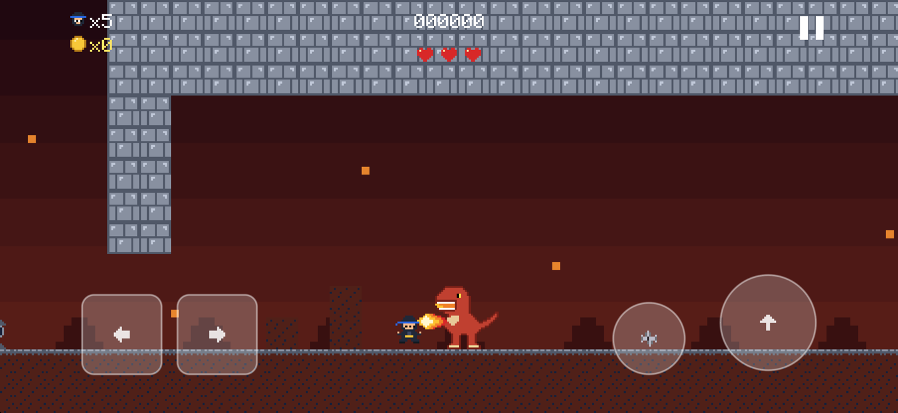

# Ninjasaurus

A Mario-style side-scroller for iPhone: a ninja against dinosaurs, made for a six-year-old.
Stomp raptors, bump blocks, grab coins, get big with an onigiri, throw shurikens, and bonk Rex on the head three times.

Everything is generated in code. Sprites are pixel art stored as character grids and rasterized at launch, sound effects are synthesized, and the icon comes from a script. No third-party dependencies, no network, no ads.






## Controls

Landscape only. The left half of the screen is the d-pad, the right half jumps. The small star button throws shurikens when you have the scroll, and holding it makes the ninja run. Game controllers and a hardware keyboard (arrows, space, X) also work.

## Build

Requirements: Xcode 26 or newer and `brew install xcodegen`.

```
make project   # generate Ninjasaurus.xcodeproj from project.yml
make test      # unit tests on the iPhone 17 Pro Max simulator
make run       # build, install and launch on the simulator
make shot      # screenshot the booted simulator into .build/
make icon      # regenerate the app icon
```

Open `Ninjasaurus.xcodeproj` to run on a real iPhone. Debug builds use automatic signing with the team's Apple Development certificate.

## Layout

```
Sources/Ninjasaurus/
  App/        UIKit shell and the SKView controller
  Core/       constants, geometry, fixed-step clock, session, progress
  Levels/     tile kinds, tile map, level parser and catalog
  World/      the simulation: player, enemies, boss, items, blocks, collider, camera
  Rendering/  pixel sprites, atlas, texture store, font, sprite art, backgrounds
  Scenes/     title, world map, game scene, HUD, overlays, effects
  Input/      touch controls and gamepad polling
  Audio/      tone synth, sound recipes, AVAudioEngine player
Resources/Levels/   one text file per level
Tests/              XCTest suite for the pure Swift parts
scripts/            icon generator, Apple setup checklist, export options
```

The simulation never imports SpriteKit. `GameWorld.step` takes an input state and returns events, which is what the tests drive.

## Levels

Levels are text files, top row first, one character per 16 px tile:

```
! name: Bamboo Meadow
! theme: grass
.....?.M........
..S.........r.F.
GGGGGGGGGGGGGGGG
################
```

`.` empty, `G` ground top, `#` fill, `=` brick, `?` coin block, `M` power-up block, `*` katana block, `+` 1-up brick, `o` coin, `^` cloud (one-way), `L` `l` log cap and body, `~` hazard, `C` checkpoint lantern, `|` stone wall.
Markers: `S` start, `F` torii gate (2 wide, 3 tall, bottom-left anchor), `r` Raptor, `a` Anky, `p` Ptero, `s` Stego, `X` Rex.

## Releasing to TestFlight

Every merge to `master` runs `.github/workflows/testflight.yml`: archive, sign with the Apple Distribution certificate, upload to App Store Connect, tag the commit. The build number is the workflow run number; the version comes from the latest `v*` tag (`feat` PR titles bump the minor, everything else the patch). Add `[skip-release]` to a PR title to skip it.

One-time Apple setup, detailed in `scripts/setup-apple.sh`:

1. Apple Distribution certificate, exported with its private key as a `.p12`.
2. App ID `dev.rbstp.ninjasaurus`.
3. App Store provisioning profile named `Ninjasaurus App Store`.
4. App record in App Store Connect.
5. App Store Connect API key (Team key, Developer role or higher).
6. After the first upload, an internal TestFlight group with your Apple ID.

Repository secrets:

| Secret | Content |
| --- | --- |
| `APPLE_DIST_CERT_P12` | base64 of the Apple Distribution `.p12` |
| `APPLE_DIST_CERT_PASSWORD` | its export password |
| `APPLE_PROVISIONING_PROFILE` | base64 of the `.mobileprovision` |
| `APPLE_KEY_P8` | base64 of the API key `.p8` |
| `APPLE_KEY_ID` | API key ID |
| `APPLE_ISSUER_ID` | API issuer ID |

Certificate and profile expire after a year; re-export and update the first three secrets.
